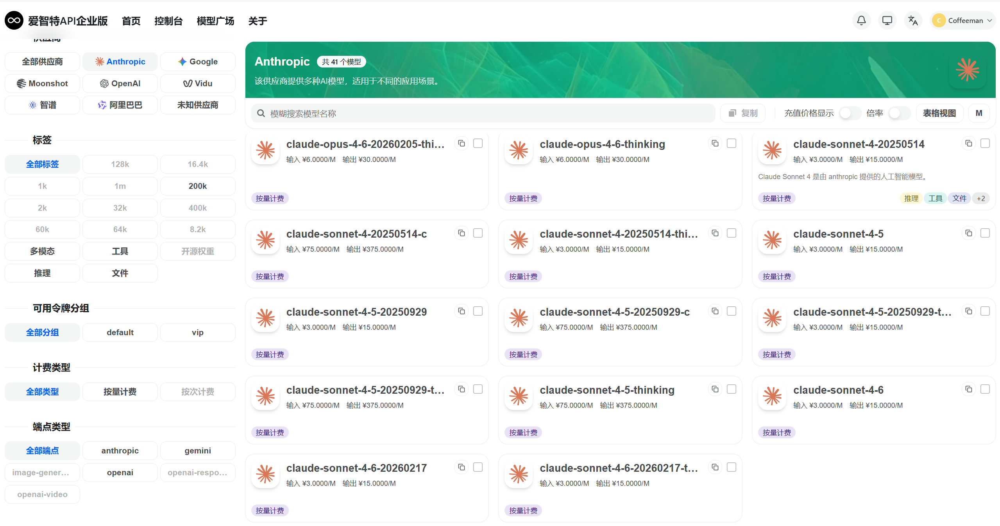
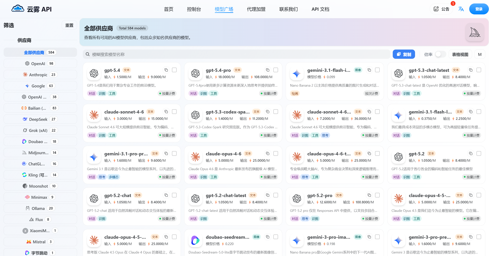

# Vibe Coding 方案全景对比

> 更新时间: 2025年3月

## 截止到26/03/24的结论
1. CLI 和 Agent 方案需要购买 API
    - CLI 方案如 claude code
    - Agent 方案如 code x 
    - API 推荐 [www.aiznt.com](https://api-us.aiznt.com/)
2. IDE 集成方案
    - Github Copilot 购买会员，团队成本可控每人每月 19$ 约合人民币 130￥ 每人每月300次请求。使用虚拟信用卡支付。
    - CLine 开源且支持接入本地模型。
3. 特别注意
    - gpt-5.4 和 claude opus 4.6 等外网大模型的中文能力不强，经常出现幻觉。

## 目录
- [什么是 Vibe Coding](#什么是-vibe-coding)
- [IDE 集成方案对比](#ide-集成方案对比)
    - [GitHub Copilot](#1-github-copilot)
    - [Cursor](#2-cursor)
    - [Windsurf](#3-windsurf-原-codeium)
    - [Cline](#4-cline)
- [CLI 终端方案对比](#cli-终端方案对比)
    - [Claude Code](#1-claude-code-)
    - [Aider](#2-aider)
    - [Copilot CLI](#3-github-copilot-cli)
- [核心能力对比矩阵](#核心能力对比矩阵)
- [选型建议](#选型建议)
- [实测效果](#实测效果)
---

## 什么是 Vibe Coding

**Vibe Coding**（氛围编程/直觉编程）是一种新兴的编程范式，开发者通过自然语言与AI进行对话式交互，让AI生成、修改、调试代码，而非传统的手动编写每一行代码。

### 核心理念
- **自然语言优先**: 用描述代替代码
- **人机协作**: AI生成草稿，人类审查和引导
- **快速迭代**: 通过对话即时修改和优化
- **降低门槛**: 让非专业开发者也能实现想法

### 典型工作流
```
需求描述 → AI生成代码 → 运行测试 → 反馈优化 → 迭代完善
```

---

## IDE 集成方案对比

### 1. GitHub Copilot
| 维度 | 详情 |
|------|------|
| **开发商** | GitHub / Microsoft / OpenAI |
| **定位** | AI 编程助手 (市场领导者) |
| **核心模型** | GPT-4o / Codex |
| **支持平台** | VS Code, JetBrains, Vim, Neovim, Xcode |
| **定价** | $10/月 (个人) / $19/月 (商业) / 免费(开源/学生) |

#### 核心功能
- ✅ **代码补全**: 行级/块级实时代码建议
- ✅ **Copilot Chat**: 侧边栏对话，解释、重构、修复代码
- ✅ **Copilot Edits**: 多文件同时编辑
- ✅ **PR 生成**: 自动生成 Pull Request 描述
- ✅ **代码审查**: AI 辅助代码审查建议

#### 优缺点
| 优点 | 缺点 |
|------|------|
| 生态最成熟，集成度最高 | 代码隐私上传云端 |
| 响应速度快 | 缺乏真正的 Agent 能力 |
| 企业版功能完善 | 免费版功能有限 |

---

### 2. Cursor
| 维度 | 详情 |
|------|------|
| **开发商** | Anysphere |
| **定位** | AI 原生 IDE |
| **核心模型** | GPT-4o / Claude 3.5 / o3 / 自定义 API Key |
| **支持平台** | 独立应用 (基于 VS Code) |
| **定价** | 免费版 / $20/月 (Pro) / $40/月 (Team) |

#### 核心功能
- ✅ **Composer**: 多文件协作编辑，自动处理依赖
- ✅ **Tab 补全**: 比 Copilot 更强的上下文感知
- ✅ **终端 AI**: 终端内直接询问AI
- ✅ **@ 符号系统**: `@file`, `@code`, `@web` 精准引用
- ✅ **Agent Mode**: 自主执行多步骤任务（Beta）
- ✅ **代码库理解**: 索引整个代码库，精准定位

#### 优缺点
| 优点 | 缺点 |
|------|------|
| 原生AI设计，体验流畅 | 需切换IDE，迁移成本 |
| Agent 能力强大 | 价格相对较高 |
| 支持自定义模型 | 重度依赖网络 |

---

### 3. Windsurf (原 Codeium)
| 维度 | 详情 |
|------|------|
| **开发商** | Codeium |
| **定位** | Agentic AI IDE |
| **核心模型** | Codeium 自研 + GPT-4o / Claude |
| **支持平台** | 独立应用 (基于 VS Code) |
| **定价** | 免费版 / $10/月 (Pro) / $30/月 (Team) |

#### 核心功能
- ✅ **Cascade**: 革命性的 Agent 工作流，自主规划执行
- ✅ **全局动作**: AI 自动创建、删除、修改多个文件
- ✅ **终端集成**: AI 可执行终端命令并观察输出
- ✅ **超级补全**: 整函数级别的预测
- ✅ **免费额度慷慨**: 个人版免费功能已经很强大

#### 优缺点
| 优点 | 缺点 |
|------|------|
| Cascade Agent 能力强 | 相对较新，生态不如Cursor |
| 性价比极高 | UI/UX 稍逊于Cursor |
| 免费版功能够用 | 自研模型质量不稳定 |

---

### 4. Cline
| 维度 | 详情 |
|------|------|
| **开发商** | 开源社区 (saoudrizwan) |
| **定位** | VS Code AI 助手插件 |
| **核心模型** | Claude / GPT-4 / Gemini / 本地模型 |
| **支持平台** | VS Code |
| **定价** | **完全免费** (仅需 API Key) |

#### 核心功能
- ✅ **自主任务执行**: AI 可创建、编辑文件，执行终端命令
- ✅ **浏览器自动化**: 支持截图、点击等浏览器操作
- ✅ **多模型支持**: 可切换任意 OpenAI 兼容 API
- ✅ **Checkpoints**: 自动保存修改历史，可随时回滚
- ✅ **MCP 支持**: Model Context Protocol 扩展能力

#### 优缺点
| 优点 | 缺点 |
|------|------|
| 完全免费开源 | 需自备 API Key，费用不可控 |
| 功能强大不输付费产品 | 配置相对复杂 |
| 隐私可控，可用本地模型 | 需自行管理上下文 |

---

## CLI 终端方案对比

### 1. Claude Code ⭐
| 维度 | 详情 |
|------|------|
| **开发商** | Anthropic |
| **定位** | 终端 AI 编程助手 |
| **核心模型** | Claude 3.5 Sonnet / Opus |
| **安装** | `npm install -g @anthropics/claude-code` |
| **定价** | 需 Claude API Key |

#### 核心功能
- ✅ **代码库理解**: 自动索引项目，理解整体结构
- ✅ **多文件编辑**: 可同时修改多个相关文件
- ✅ **终端集成**: 直接执行命令并观察结果
- ✅ **Git 集成**: 自动 commit、创建分支
- ✅ **交互模式**: 对话式任务执行

#### 典型使用场景
```bash
# 初始化项目理解
claude .

# 执行具体任务
claude "重构 utils.py，将重复的HTTP请求逻辑提取到单独函数"
```

#### 优缺点
| 优点 | 缺点 |
|------|------|
| Claude 3.5 编程能力顶级 | 需Anthropic API，国内访问难 |
| 代码库级上下文理解 | 无GUI，纯终端交互 |
| 真正的Agent体验 | 月消耗可能较高 |

---

### 2. Aider
| 维度 | 详情 |
|------|------|
| **开发商** | 开源社区 (paul-gauthier) |
| **定位** | AI 结对编程助手 |
| **核心模型** | GPT-4 / Claude / Gemini / 本地模型 |
| **安装** | `pip install aider-chat` |
| **定价** | **完全免费** (仅需 API Key) |

#### 核心功能
- ✅ **多文件编辑**: 自动处理跨文件依赖
- ✅ **Git 集成**: 自动提交，保留修改历史
- ✅ **语音支持**: 支持语音输入指令
- ✅ **代码审查**: AI 辅助代码审查
- ✅ **多种模式**: 代码模式、架构模式、询问模式

#### 典型使用场景
```bash
# 启动并添加文件到上下文
aider src/main.py src/utils.py

# 自然语言指令
> 添加异常处理，记录错误日志到文件
```

#### 优缺点
| 优点 | 缺点 |
|------|------|
| 开源免费，社区活跃 | 界面相对简陋 |
| Git集成优秀 | 学习曲线稍陡 |
| 多模型灵活切换 | 配置较繁琐 |

---

### 3. GitHub Copilot CLI
| 维度 | 详情 |
|------|------|
| **开发商** | GitHub |
| **定位** | 命令行辅助工具 |
| **安装** | `gh extension install github/gh-copilot` |
| **定价** | Copilot 订阅包含 |

#### 核心功能
- ✅ **自然语言转命令**: `gh copilot suggest "列出所有docker容器"`
- ✅ **命令解释**: `gh copilot explain "ps aux | grep nginx"`
- ✅ **别名支持**: 快速创建常用命令别名

#### 优缺点
| 优点 | 缺点 |
|------|------|
| 与Copilot订阅捆绑 | 功能相对简单 |
| 命令解释实用 | 仅Shell命令，不编辑代码 |
| 学习命令的好工具 | 依赖GitHub生态 |

---

#### 核心功能
- ✅ **代码生成**: 快速生成脚本代码
- ✅ **命令生成**: 自然语言转Shell命令
- ✅ **本地支持**: 可对接Ollama本地模型
- ✅ **轻量级**: 配置简单，资源占用低

#### 典型使用场景
```bash
# 生成命令
sgpt "查找当前目录下大于100MB的文件"

# 生成代码
sgpt --code "Python读取CSV并绘制折线图"
```

---

## 核心能力对比矩阵

| 能力 | Copilot | Cursor | Windsurf | Cline | Claude Code | Aider | Continue |
|------|:-------:|:------:|:--------:|:-----:|:-----------:|:-----:|:--------:|
| **代码补全** | ⭐⭐⭐ | ⭐⭐⭐ | ⭐⭐⭐ | ⭐⭐ | - | - | ⭐⭐ |
| **多文件编辑** | ⭐⭐ | ⭐⭐⭐ | ⭐⭐⭐ | ⭐⭐⭐ | ⭐⭐⭐ | ⭐⭐⭐ | ⭐ |
| **Agent自主执行** | ⭐ | ⭐⭐⭐ | ⭐⭐⭐ | ⭐⭐⭐ | ⭐⭐⭐ | ⭐⭐ | - |
| **终端集成** | ⭐⭐ | ⭐⭐⭐ | ⭐⭐⭐ | ⭐⭐⭐ | ⭐⭐⭐ | ⭐⭐ | ⭐ |
| **代码库理解** | ⭐⭐ | ⭐⭐⭐ | ⭐⭐⭐ | ⭐⭐ | ⭐⭐⭐ | ⭐⭐ | ⭐ |
| **本地/隐私模式** | ⭐ | ⭐ | ⭐ | ⭐⭐⭐ | ⭐ | ⭐⭐⭐ | ⭐⭐⭐ |
| **开源免费** | - | - | - | ⭐⭐⭐ | - | ⭐⭐⭐ | ⭐⭐⭐ |
| **上下文长度** | 中等 | 大 | 大 | 大 | 极大 | 大 | 可调 |

**图例**: ⭐⭐⭐ 优秀 | ⭐⭐ 良好 | ⭐ 一般 | - 不支持

---

## API选择
### Aiznt
链接: [aiznt](https://api-us.aiznt.com/pricing)   
定价: 

### Yunwu
链接: [yunwu](https://yunwu.ai/pricing)    
定价: 

---

## 选型建议

### 🏆 按场景推荐

| 场景 | 首选工具 | 备选方案 | 理由 |
|------|----------|----------|------|
| **追求极致AI体验** | Cursor | Windsurf | 原生AI设计，Agent能力强 |
| **性价比优先** | Windsurf | Cline | Windsurf免费版够用，Cline完全免费 |
| **完全免费开源** | Cline | Continue + Aider | 功能强大且零成本 |
| **企业安全合规** | Tabnine | Amazon Q | 本地部署，认证齐全 |
| **终端重度用户** | Claude Code | Aider | 代码库级理解，Agent执行 |
| **VS Code用户** | Copilot | Cline + Continue | 生态成熟，安装方便 |
| **隐私敏感场景** | Continue + Ollama | Tabnine本地版 | 代码不上云，完全本地 |
| **快速原型开发** | Windsurf | Cursor | Cascade模式迭代快 |
| **大型项目维护** | Cursor | Claude Code | 代码库理解能力强 |

### 💡 组合方案建议
---

## 趋势展望

1. **Agent 化**: 从代码补全走向自主任务执行
2. **多模态**: 支持图像、文档、设计稿输入
3. **本地部署**: 企业级本地化需求增长
4. **垂直领域**: 针对特定语言/框架的专用工具
5. **人机协作**: 更自然的协作模式，AI成为真正的"结对编程伙伴"

---


## 实测效果
- 截至到26/03/24的测试，实际使用体验上 vibe coding 在 cli 上的使用体验超过 IDE 集成。
- 使用的 aiznt 和 yunwu 两种 API 中转站，实际体验：yunwu 更便宜但只能看到当天 token 消耗量，无法看到历史 token 不便于管理。
- 实际使用的问题：面对多人使用的场景且是 cli 方式，购买 API 的策略成本可能大于购买会员。但购买 API 可以使用中转站，购买会员的方式暂未找到合适的中转站